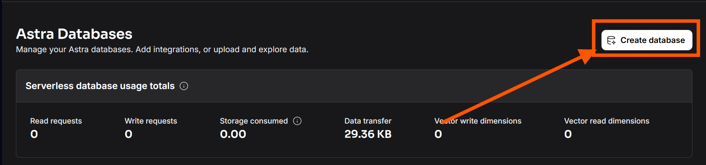
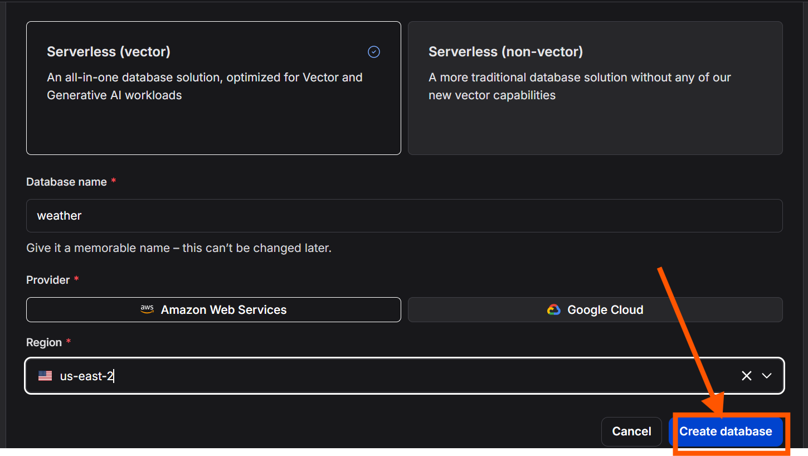
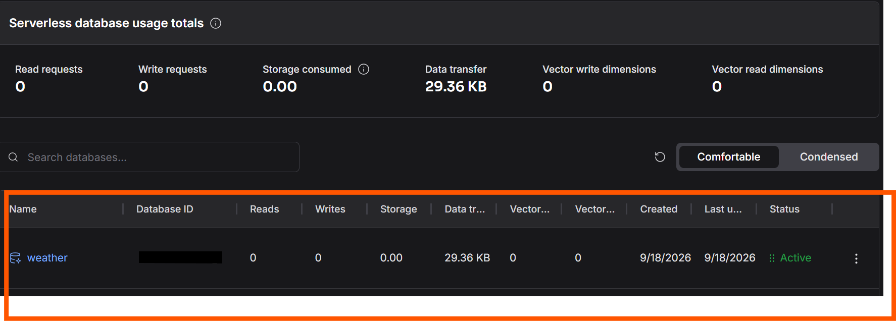
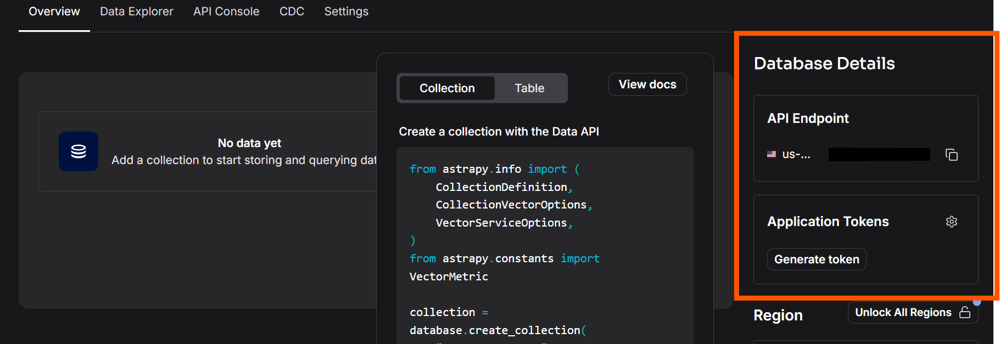
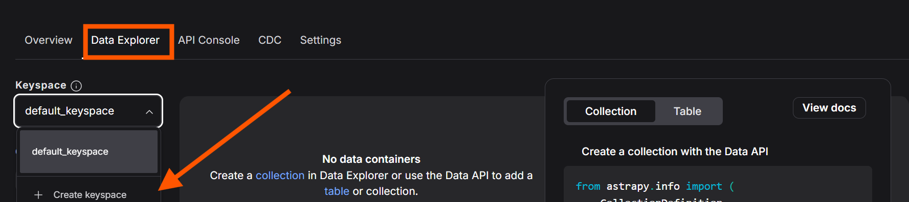
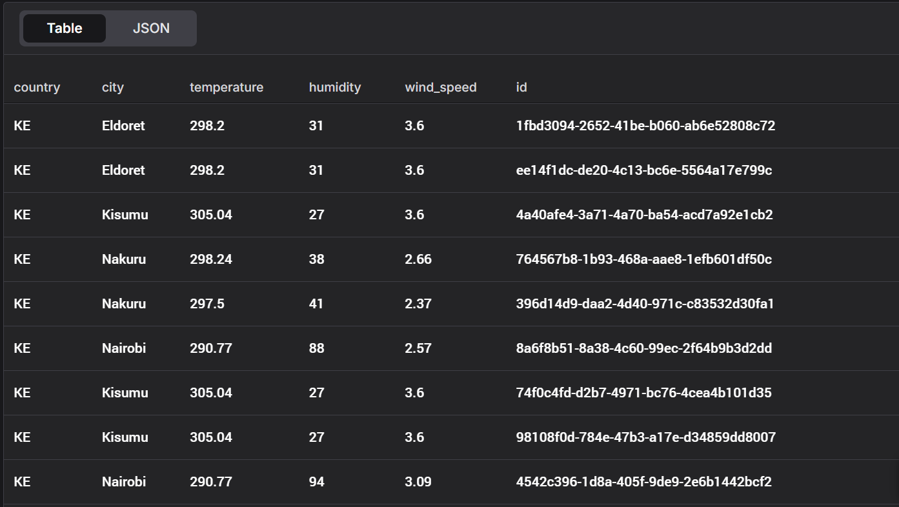

# Weather Streaming ETL with Kafka and AstraDB (Cassandra)
## Context
1. [Project Overview](#1-project-overview)
2. [Prerequisites](#2-prerequisites)
3. [Tech Stack](#3-tech-stack)
4. [Project Structure](#4-project-structure)
5. [Project Architecture](#5-project-architecture)
6. [Environment Setup](#6-environment-setup)
7. [Running the Project](#7-running-the-project)

## 1. Project Overview
This is an ETL pipeline which extracts weather data of major cities in Kenya from the [OpenWeather API](https://openweathermap.org/api), transforms it into the required structure, uploads the data to kafka for streaming, and stores the data streams into DataStack's serverless Cassandra database, [AstraDB](https://docs.datastax.com/en/astra-db-serverless/index.html).
## 2. Prerequisites
1. Install [kafka](https://kafka.apache.org/community/downloads/).
2. Create an [Astra account](https://docs.datastax.com/en/astra-db-serverless/get-started/quickstart.html).
3. Obtain an [OpenWeather API key](https://openweathermap.org/api).

## 3. Tech Stack
1. Python
2. Cassandra
3. AstraDB API client
3. Kafka Streaming
4. Pandas
5. OpenWeather API

## 4. Project Structure
```text
├── README.md                   #project documentation
├── astra
│   ├── __init__.py             #package initialization
│   ├── db_api_client.py        #Astra db connection client
│   └── table_definition.py     #create cassandra tables
├── config.py                   #environment configuratoins
├── kafka_clients
│   ├── __init__.py             #package initialization
│   ├── consumer.py             #kafka consumer logic
│   └── producer.py             #kafka producer logic
├── main.py                     #streaming logic synchronization
└── requirements.txt            Required dependencies
```
## 5. Project Architecture
This project contains 2 main components:
1. producer
2. consumer

### Producer
The producer, which is defined inside the [producer.py](producer.py) file, extracts the weather data from the OpenWeather REST API by implementing the python `requests` library, transforms it into the shape that befits the requirements using `pandas`, and writes to a kafka topic for streaming.
### Consumer
The consumer's work is to connect the application to AstraDB using the API client `astrapy`, and to write the data been streamed from kafka into the DB.
### General Structure:
```text
 _______________
|OpenWeather API|
|_______________|
    ⬇
 --------
|producer|
 --------
    ⬇
  _____
 |Kafka|
 |_____| 
    ⬇
 --------
|Consumer|
 --------
    ⬇
 __________________
|AstraDB(Cassandra)|
|__________________|
```
## 6. Environment Setup
### 1. python virtual environment
Create and activate a virtual environment that will manage the project dependencies.
```bash
$ python -m venv <your_venv_name>
$ source <your_venv_name>/bin/activate 
```
### 2. Cloning the repository
Clone the project repository and switch to the project directory
```bash
$ git clone <git_repository>
$ cd weather_streaming_etl
```
### 3. .env Configuration
create a .env file and copy paste the details inside the [.env.example](.env.example) file. Replace the configuration values with your own.
```bash
$ touch .env
```
### 4. Astra DB Endpoint, Token, and keyspace
Inside your Astra account, navigate to the top right corner of the landing page and click `create database`. A window will pop up requiring some configuration details for the database. Once the database is done initializing, it will appear at the bottom of the landing page.
<div>

<figcaption align="center"><i>creating an Astra database</i></figcaption>
</div><br/>

<div>

<figcaption align="center"><i>Database configuration</i></figcaption>
</div><br/>

<div>

<figcaption align="center"><i>Database list</i></figcaption>
</div><br/>

Click on the database name and navigate to the right hand side of the page where the `API endpoint` and `token` generation option are provided. Copy and paste these inside the .env file created in the previous step.
<div>

<figcaption align="center"><i>API endpoint and token</i></figcaption>
</div><br/>

To create a keyspace navigate to `data explorer > Keyspace > create_keyspace`
<div>

<figcaption align="center"><i>Creating a keyspace</i></figcaption>
</div><br/>

## 7. Running the Project
### 1. Starting the cluster manager and Kafka server
Inside the kafka installation dirrectory, locate the `/bin/` and `/config/` folders then run the command below to start the zookeeper cluster manager.
```bash
:~kafka$ bin/zookeeper-server-start.sh config/zookeeper.properties
```
Then on a new terminal start the kafka server with the following command:
```bash
:~kafka$ bin/kafka-server-start.sh config/server.properties
```
### 2. Running the pipeline
Once kafka is up and running, inside the project root dirrectory, run the command below to start the pipeline
```bash
python -m main
```
### 3. Checking table data
The table of the data uploaded to cassandra will be found under the keyspace created. The table can be filtered based on the columns of the table.
<div>

<figcaption align="center"><i>AstraDB table</i></figcaption>
</div><br/>